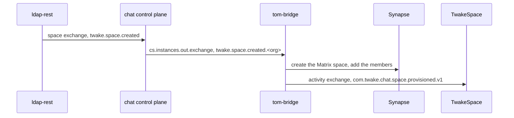

# Spaces

With a `spaces` block in its config, the bridge gives each TwakeSpace space a
Matrix space on the organization's homeserver, and keeps its members in line
with their roles in the directory.



## Events

ldap-rest publishes the space events of every organization on the `space`
exchange. In SaaS, the chat control plane forwards each one to its
organization's bridge with the organization id appended to the routing key, so
a bridge only receives its own. A single installation binds `twake.space.#` on
`space` directly.

* `created` - creates the Matrix space, adds TwakeSpace's app service user and
  the members, then publishes `com.twake.chat.space.provisioned.v1` with the
  room id on the activity exchange.
* `updated` - renames the Matrix space.
* `member.added`, `member.role.changed` - adds the member with the level of
  their role.
* `member.removed` - removes the member.
* Group events are ignored: ldap-rest also publishes a member event for each
  user a group change affects.

## The Matrix space

* It is unencrypted, so the bridge and TwakeSpace can read it.
* Its alias is `#twake-space-<space id>`, lowercased since the directory
  ignores the case of space ids. The bridge finds the room again from
  the space id through it, so a redelivered `created` reuses the room and
  announces it again. The bridge's registration must reserve these aliases,
  or Synapse refuses to create the room with `M_EXCLUSIVE`:

  ```yaml
  namespaces:
    aliases:
      - exclusive: true
        regex: "#twake-space-.*:<domain>"
  ```

* The bridge bot is the only one at level 100, so membership and settings only
  change through the directory. Editors, admins and TwakeSpace's user are at
  50 and can post. Viewers stay at 0 and only read.
* A member without a Matrix account gets one, named the way the SSO mapping
  names it (`localpartFrom`). For that person to sign in, the homeserver's OIDC
  provider needs `allow_existing_users: true`.

## Ordering

The space queue has a single active consumer, and the bridge handles its
events one at a time, so two pods never change the same space at once.

Events can still reach the bridge out of order, through retries. The bridge
stores the timestamp of the last change it applied to each member and to the
space name, and ignores an older event. Without the database, it applies every
event.

A member the SSO mapping cannot name (no username, or no usable email) is left
out and logged, and the rest of the event goes ahead.

A member event for a space without a Matrix space yet fails, and is retried
until its `created` event has been handled or the retries run out.

<!-- vim: set ft=markdown fenc=utf-8 spell spl=en tw=80 cc=80 et ts=2: -->
